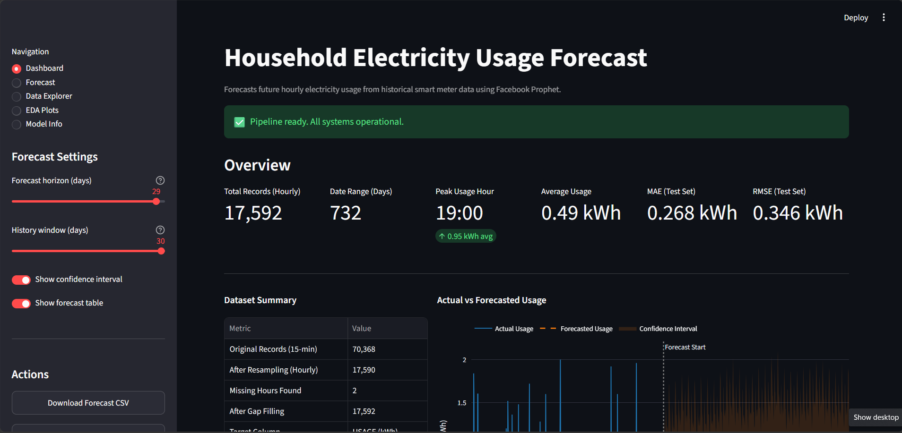
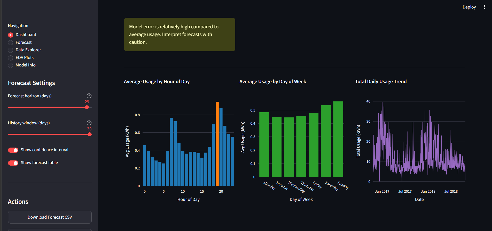
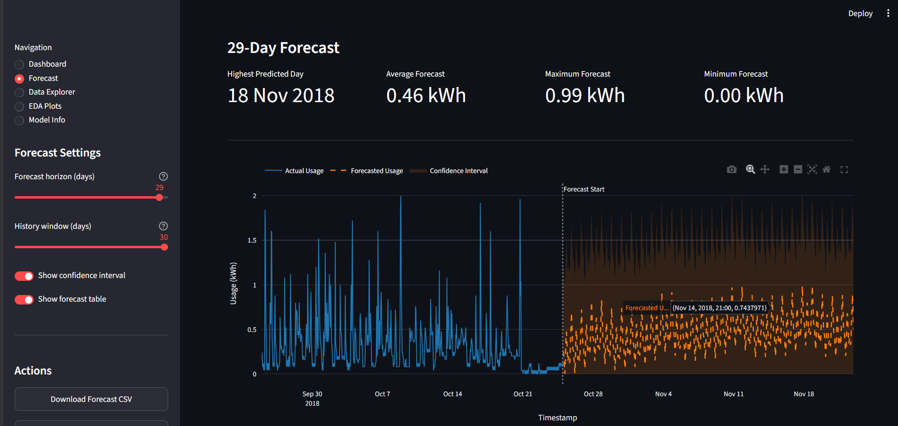
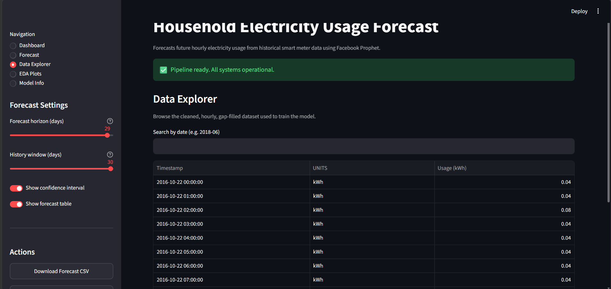
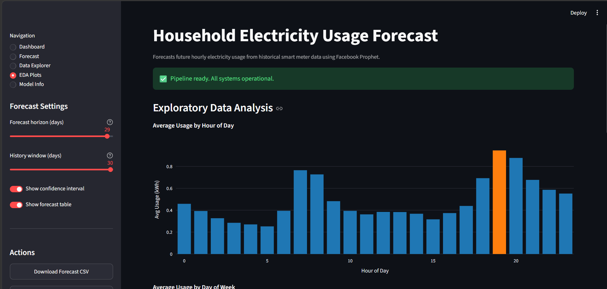
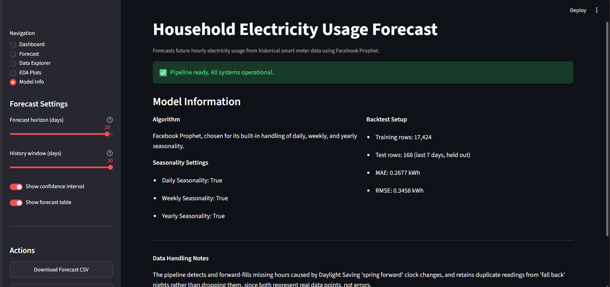

# Household Electricity Usage Forecasting

Forecasts future hourly electricity usage from historical smart meter data, using
Facebook Prophet. Built as a two-day, end-to-end data science project: raw meter
readings in, an interactive forecasting dashboard out.

## Dataset

`D202.csv` - 15-minute interval smart meter readings, October 2016 to October 2018
(70,368 rows). Columns: TYPE, DATE, START TIME, END TIME, USAGE, UNITS, COST, NOTES.

## Why Prophet

The data has strong daily, weekly, and yearly seasonality (people use more electricity
in the evening, more on weekends, more in certain seasons). Prophet is built
specifically to decompose and forecast this kind of pattern, requires very little
manual feature engineering, and extrapolates future trends, unlike models such as
Random Forest that only interpolate within the range of values they were trained on.

## Project Structure

```
electricity-usage-forecasting/
│
├── data/
│   ├── raw/
│   │   └── D202.csv
│   └── processed/
│       ├── cleaned_15min.csv
│       ├── hourly_usage.csv
│       └── hourly_usage_gapfilled.csv
│
├── src/                              ← core logic, one job per file
│   ├── __init__.py
│   ├── config.py
│   ├── data_loader.py
│   ├── data_cleaner.py
│   ├── resampler.py
│   ├── gap_handler.py
│   ├── eda.py
│   ├── train_model.py
│   ├── evaluate.py
│   └── forecast_future.py
│
├── models/
│   └── prophet_model.pkl             ← trained model, saved to disk once
│
├── notebooks/
│   └── electricity_forecasting.ipynb ← viva walkthrough, imports from src/
│
├── app.py                            ← Streamlit interface (the "product")
│
├── outputs/
│   ├── figures/
│   └── forecast_vs_actual.csv
│
├── docs/
│   └── screenshots/                  ← dashboard screenshots, used in this README
│       ├── dashboard_overview.png
│       ├── dashboard_insights.png
│       ├── forecast_page.png
│       ├── data_explorer.png
│       ├── eda_plots.png
│       └── model_info.png
│
├── report/
│   └── project_report.md
│
├── requirements.txt
└── README.md
```

## Setup

```
pip install -r requirements.txt
```

Place `D202.csv` inside `data/raw/` before running anything.

## Running the Pipeline

Each module can be run on its own, in this order, from the project root:

```
python -m src.data_loader
python -m src.data_cleaner
python -m src.resampler
python -m src.gap_handler
python -m src.eda
python -m src.train_model
python -m src.evaluate
python -m src.forecast_future
```

Or open `notebooks/electricity_forecasting.ipynb` to walk through every step with
explanations and inline charts.

## Running the Dashboard

```
streamlit run app.py
```

## Step-by-Step Process

**Data preparation and EDA**

| # | Step | Detail |
|---|---|---|
| 1 | Load raw data | Read D202.csv (70,368 rows) |
| 2 | Clean | Merge DATE+START TIME -> `timestamp`, drop unused columns, sort |
| 3 | Resample to hourly | Floor to hour -> group -> sum (manual code, explained) |
| 4 | Handle missing timestamps | Reindex to a complete hourly range, detect gaps, forward-fill the 2 DST gaps, explain why |
| 5 | Noise-reduction visual | Overlay/compare a sample window of 15-min vs. hourly data to visually justify resampling |
| 6 | EDA - daily/weekly patterns | Hour-of-day peak chart, day-of-week chart, overall 2-year trend chart |
| 7 | Prepare for Prophet | Rename columns to `ds` / `y` |

**Modeling and evaluation**

| # | Step | Detail |
|---|---|---|
| 8 | Train/test split | Last 7 days = test, rest = train (time-based, not random) |
| 9 | Build & fit Prophet | daily + weekly + yearly seasonality enabled |
| 10 | Forecast | Predict the held-out test week |
| 11 | Evaluate | MAE + RMSE (skip MAPE, as discussed) |
| 12 | Visualize | Actual vs. predicted chart + Prophet's component breakdown |
| 13 | Conclusion | Summarize peak hour finding, model accuracy, and DST/missing-data handling in the report |

## Results

- **Peak usage hour**: 19:00 (7 PM), averaging 0.946 kWh
- **Model accuracy (backtest)**: MAE 0.268 kWh, RMSE 0.346 kWh
- **Missing hours found**: 2 (both Daylight Saving "spring forward" transitions)
- **Duplicate timestamps found**: 8 (Daylight Saving "fall back" nights, kept as-is)

Note: Mean Absolute Percentage Error (MAPE) was tested and excluded from reporting.
Since many hours have usage near zero, MAPE produces misleadingly huge percentages
(small absolute errors divided by near-zero actual values). MAE and RMSE are used
instead, since they don't have this problem.

## Dashboard

The dashboard has five pages, all built on top of the same `src/` pipeline:

**Dashboard** - overview cards (total records, date range, peak usage hour, average
usage, MAE, RMSE), a dataset summary table, key insights, the actual-vs-forecast chart,
and the three EDA charts.




**Forecast** - adjustable forecast horizon (1-30 days), with highest predicted day,
average/maximum/minimum forecast, an interactive actual-vs-forecast chart with
zoom and pan, and a searchable forecast table.



**Data Explorer** - the full cleaned, hourly, gap-filled dataset, searchable by date,
sortable by clicking any column header, with a CSV download option.



**EDA Plots** - the hour-of-day, day-of-week, and daily trend charts on their own page.



**Model Info** - Prophet's seasonality settings, backtest train/test sizes, MAE/RMSE,
and notes on how Daylight Saving duplicates and gaps are handled.



## Requirements

```
pandas>=2.0.0
prophet>=1.1.0
matplotlib>=3.7.0
plotly>=5.13.0
streamlit>=1.22.0
```
